# 数据结构复习
> `实验/`为个人提交  
> `PPT/`为2025任国珍老师上课所用，有一点我的勘误    
> `题目/`为前人搜集的往年题  
> `一些资料/`如有侵权，联系我删除  

这门课不难  
实验课一定要拿满分（46开）  
多练多练多练！先理解，再记代码。  

考试题目为少量填空+大题。真正写代码的题目（30分）有两或三道，其它题目（70分）可能考察算法思想，或者让你画出某一时刻的结果、运行过程之类的。  
对于每个数据结构，明白它的用处，增删改查写法；对于算法，明白算法思想，运行过程，能手动进行这个算法。  
写代码的题（算法题）主要考察贪心、分治、动态规划，如果结合上前面学过的算法会比较难，看平时的积累。实在没思路就写个暴力枚举，图/树写个回溯，应该能给点分吧。

## 第一章 C++回顾

### 递归
写一个函数，相信它能完成任务，并在其中调用自己完成局部任务。一般包含递归出口和任务处理。

### STL
我认为常见的STL考试时是可以写的，当然前提是本题的主要考点不是这个STL本身。比如本题就是考双向链表，肯定不能直接用list写。

## 第二、三、四章
这几章搞懂大O渐进记法就可以了。  
### 空间复杂度
一般来说，不使用数组，$O(1)$，一维数组 $ O(n) $，二维数组$ O(n^2) $...  
题目里说不使用额外空间时，不能开大小与规模n相关的数组，但是可以使用任意个变量。
### 时间复杂度
多数情况，可以看循环，t层循环就为$ O(n^t) $。但考的难的话，是会两层循环但其实是$ O(n) $的，这需要仔细分析。

## 第五章 线性表-数组描述
### 线性表数据结构
有序集合，形式为$ (e_0, e_1, e_2,...e_{n-1}) $，n是线性表的长度/大小。需要支持的操作有：  
- 创建
- 销毁
- 判空
- 获取长度
- 按索引查找元素
- 按元素获取索引
- 按索引删除
- 按索引插入
- 从左至右输出
### 映射公式
最一般地，**$ location(i)=i $**。也可以倒过来: $ location(i)=arrayLength-1-i $。或者从特定位置开始存储：$ location(i)=(location(0)+i)\%arrayLength $等等，可以搞得比较花哨。
### 变长一维数组
### arrayList
### C++迭代器*（推荐掌握，但是考试应该不会考）
### vector*

## 第六章 线性表-链式描述
### 单向链表
### 循环链表和头节点

为了方便某些操作，可以为链表单独设置一个头节点，它不存数据，只作为链表的入口使用。

把链表的最后一个节点的next指向链表的头节点，那么这个链表就是循环链表。  
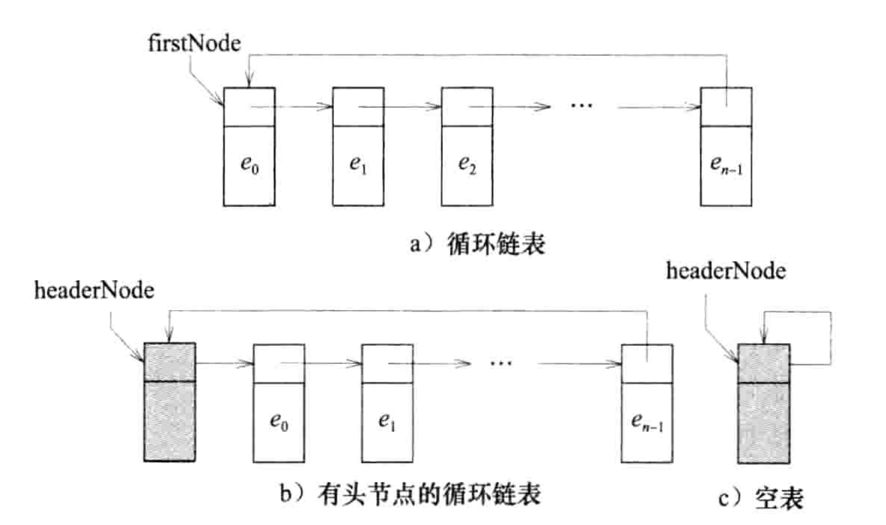

### 双向链表
每个节点，同时维护下一个元素与前一个元素指针  
### 箱子排序（桶排序）
如果我们知道待排序数组的数值范围，那我们可以直接**把值相同的元素放在一起，然后按顺序收集**一下就可以啦。因为我们不知道每个值可能有几个元素，所以我们可以使用链表来存储某个值包含的元素，这样可以节省空间。

时间复杂度$ O(size+range) $，空间复杂度$ O(range) $，**仅适用于数值范围已知且较小的情况**。可以是**稳定排序**

下面给出的是范围从0到range的处理，还可以针对范围写得更健壮。
```C++
void binSort(int* arr, int size, int range){
    //初始化
    list<int> *bin = new list<int> [range+1];

    //把元素放到对应的桶里
    for(int i = 0; i < size; ++i){
        //要达到稳定排序，存和取必须从不同端
        bin[ arr[i] ].push_front( arr[i] ); 
    }

    //收集结果
    size = 0;
    for(int i = 0; i <= range; ++i){
        while(!bin[i].empty()){
            //取
            arr[size++] = bin[i].back();    
            bin[i].pop_back();
        }
    }

    delete[] bin;
}
```
### 基数排序
当待排序数组数值范围很大时，我们不能直接使用桶排序，会消耗很大的空间。

考虑对每个元素，**按照基数r进行分解**，每个元素得到c个r进制数，**依次对元素以它的一个r进制数为标准进行桶排序**，最终可以达到原数组的排序。因为桶排序是稳定排序，对第k位排序后，前k-1位也是有序的，排完c位之后，整个数组就是有序的了。

分解某个数：从低到高，各位依次是
$$
x \% r, \frac{x \% r^2}{r}, \frac{x \% r^3}{r^2}, ... \frac{x \% r^c}{r^{c-1}} 
$$

十进制数928可以按照基数10分解为数字9，2和8   
3725用基数60来进行分解则可以得到1，2和5: $ (3725)_{10}=(125)_{60} $

例如对下面的n=10数组，按基数r=10，进行排序：  
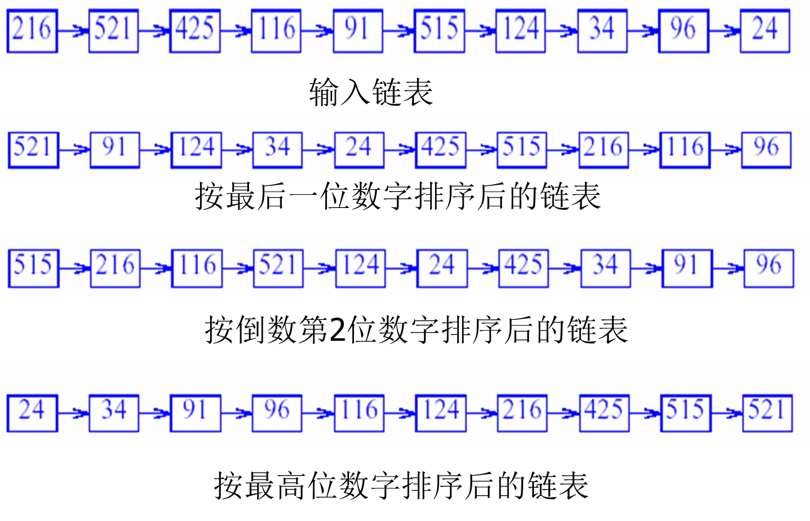  
当使用基数r=n对n个介于$0 到 n^c-1$范围内的整数进行分解时，每个数将可以分解出c个数字。
因此，可以采用c次箱子排序，每次排序时取range=n。

时间复杂度为$ O(cn)= O(n) $（因为c是一个常量）

### 并查集
[代码](/code/并查集.cpp)  
解决在线等价类问题

## 第七章 数组和矩阵
### 数组的行主映射和列主映射
内存实际上是一维连续的，在存储多维数组时，需要把它映射到一维空间上。有行主映射和列主映射两种方式。

我们先来看二维数组的情况。现在有一个数组`int a[m][n];`，那么它将占内存中的a ~ a + m\*n-1的地址空间，为了简化，我们不考虑数据类型的字节数。需要把每个元素a[i][j]放到一个位置。
- 行主映射：依次安排每一行的元素，映射公式为$ map_h( i, j ) = n*i+j $。  
也就是说，在内存中按顺序是$a[0][0], a[0][1], ... a[0][n-1], a[1][0], ...$  
- 列主映射：依次安排每一列的元素，映射公式为$map_l(i, j) = m*j+i$。
在内存中按顺序是$a[0][0], a[1][0], a[2][0], ... a[m-1][0], a[0][1], ...$

再来看多维的情况。我们知道，n维数组可以理解为n-1维数组的**数组**，我们需要先安排n-1维数组，然后再把它们组织起来。现在我们有一个n维数组$ a[u_1][u_2]...[u_n] $
- 行主映射：$ map_n(i_1, i_2,...i_n) = map_h( i_1, map_{n-1}(i_2, i_3,...i_{n} ) ) = i_1*u_2*u_3...*u_n + map_{n-1}(i_2, i_3,...i_{n}) = ... = i_1*u_2*u_3...*u_n + i_2*u_3*u_4...u_n + ... + i_n$  
- 列主映射：$ map_n(i_1, i_2,...i_n) = map_l( map_{n-1}(i_1, i_2,...i_{n-1} ), i_n) = i_n*u_1*u_2...*u_{n-1} + map_{n-1}(i_1, i_2,...i_{n-1}) = ... = i_n*u_1*u_2...*u_{n-1} + i_{n-1}*u_1*u_2...*u_{n-2} + ... + i_1 $  

记忆法：行主映射后面的下标变化引起的变化小，列主映射前面的下标变化引起的变化小。
### 矩阵
#### 定义和操作
使用二维数组存储数据，支持的操作：
- 转置
- 矩阵加
- 矩阵乘 
#### matrix
### 特殊矩阵

- 方阵：行数和列数相同的矩阵。
  常用方阵：
    - 对角矩阵:当且仅当i!=j时，有M(i,j) = 0
    - 三对角矩阵:当且仅当|i-j| > 1时，有M(i,j) = 0
    - 下三角矩阵:当且仅当i < j时，有M(i,j) = 0	
    - 上三角矩阵:当且仅当i > j时，有M(i,j) = 0	
    - 对称矩阵(symmetric):当且仅当对于所有的i和j，有M(i,j) = M(j,i)

因为这些方阵的特殊性质，我们可以采用一些手段节省存储空间，不开m*n的二维数组。

### 稀疏矩阵
只有少量非零元素的矩阵

我们可以只存储非零元素
#### 用单个线性表描述(数组存储) 
按照行优先，列其次的顺序，把包含元素的对象{col, row, data}存到数组中。

增加元素或查找元素时，二分查找位置。  
转置时，需要维护行列顺序，不是简单的把每一项行列交换。
矩阵加时，考虑使用双指针，结果矩阵的元素个数并不能在$ O(1) $内得出。
#### 用多个线性表描述（链式存储） 
链表数组/链表如图：  
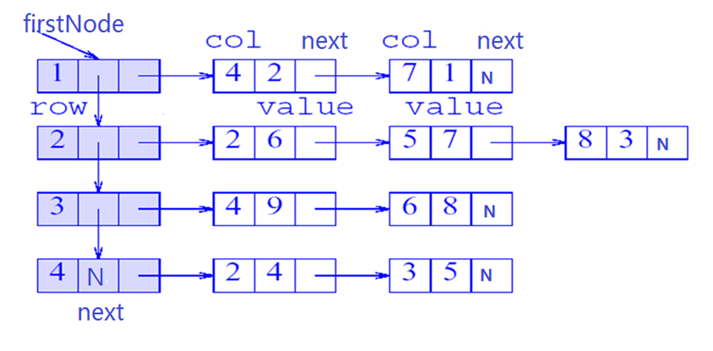

## 第八章 栈
### 定义和应用
定义：栈（stack）是一个线性表，其插入（也称为添加）和删除操作都在表的**同一端**进行。
其中允许插入和删除的一端被称为栈顶（top）,另一端被称为栈底（bottom）

bottom $ e_0, e_1, e_2, …, e_i, …, e_{n-2}, e_{n-1} $ top   

栈是一个后进先出( LIFO (Last-In, First-Out) )表

### 抽象数据类型
```C++
template <class T>
class stack{   
    public:
        virtual ~stack() {} 
        //栈为空时返回true，否则返回false
        virtual bool empty() const = 0;
        //返回栈中元素个数
        virtual int size() const = 0;
        //返回栈顶元素
        virtual T& top() = 0;
        //删除栈顶元素 
        virtual void pop() = 0;
        //将元素theElement压入栈
        virtual void push(const T& theElement) = 0;      
}
```
### 数组描述
一个数组存数据`T *data;`，一个指针指栈顶`int top;`

push: `data[++top] = val;`必要时扩容  
pop: `top--;`  

### 链表描述
用单链表，入栈头节点插入，出栈头节点删除。
### 应用
#### 括号匹配
[括号匹配-洛谷](https://www.luogu.com.cn/problem/B2165)  
[个人题解](/code/solution/lg-B2165.cpp)
#### 汉诺塔*
[递归解法](/code/solution/hanoi.cpp)  
[汉诺塔-力扣](https://leetcode.cn/problems/hanota-lcci/description/)：传统的  
[汉诺塔-洛谷](https://www.luogu.com.cn/problem/P4285)：提供了另一个解法思路  
[新汉诺塔-洛谷](https://www.luogu.com.cn/problem/P1242)：变体，比较难
#### 列车车厢重排
贪心+模拟
#### 开关盒布线*
#### 离线等价类问题*
#### 迷宫老鼠
深度优先搜索


## 第九章 队列
### 定义和应用
定义:
队列（queue）是一个线性表，其插入和删除操作分别在表的不同端进行。
添加新元素的那一端被称为队尾(queueBack)。
删除元素的那一端被成为队首(queueFront)。

       e0, e1, e2, …, ei, …, en-1
       ↑                       ↑
    queueFront              queueBack

队列是一个先进先出（ first-in-first-out, FIFO）的线性表。

### 抽象数据类型 
```C++
template <class T>
class queue{   
    public:
        virtual ~queue() {} 
        //队列为空时返回true，否则返回false 
        virtual bool empty() const = 0;
        //返回队列中元素个数
        virtual int size() const = 0;
        //返回队列头元素；
        virtual T& front() = 0;
        //返回队列尾元素
        virtual T& back() = 0;
        //队列头元素
        virtual void pop() = 0;
        //将元素theElement加入队尾
        virtual void push(const T& theElement) = 0;          
}

```
### 数组描述
注意循环位置映射的处理
### 链表描述
### 应用
#### 列车车厢重排
#### 电路布线*
#### 图元识别*
#### 工厂仿真*


## 第十章 跳表和哈希
我觉得这章叫字典是不是更合适？
### 字典
也称为Map，C++里常用unordered_map，Java里的HashMap
有序对< key, value >的集合。普通字典要求每个对的key不能相同，一个对的唯一标志是key，通过key查找value。  

### 抽象数据类型
```C++
template <class K, class E> 
class dictionary {   
  public:
    virtual ~ dictionary() {} 
    virtual bool empty() const = 0;//字典为空时返回true，否则返回false 
    virtual int size() const = 0;//返回字典中数对的个数
    virtual pair<const K,E>* find (const K&) const = 0;//返回匹配数对中的指针；
    virtual void erase(const K&) = 0;//删除匹配的数对
    virtual void insert(const pair<const K,E>&) = 0;//在字典中插入一个数对
}
```
### 线性表描述
把键值对存储到线性表中。  
- 数组：按key单调组织键值对
    - 查找：二分查找$ O(log n) $
    - 插入删除：先查找，再移动元素$ O(n) $

- 链表：
    - 插入删除查找：$ O(n) $

### 跳表描述*
试图在链表的基础上，做到“二分查找”。  
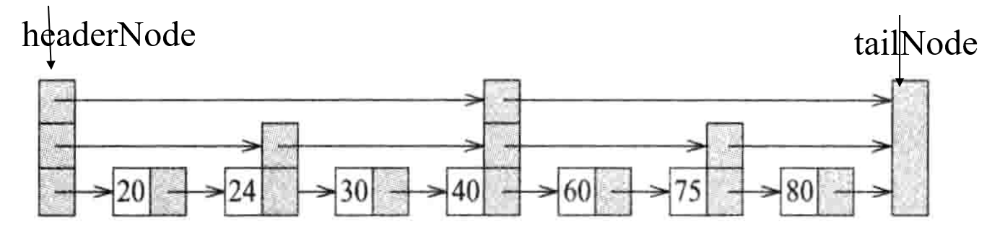  
每个节点可以同时属于第0~k级链表，所以需要一个指针数组存放不同级的后继节点`skipNode<K, V> **nexts;`(一个\*表示指针，一个\*表示数组)

插入删除时，需要维护跳表的性质。

### 散列表描述

均匀散列函数：映射到一个桶里的关键字大致相同  
b=11，[0,98],每个桶里大概9个  
b=11，[0,999],每个桶里大概91个  
除余散列：f(k) = k % b 能做到均匀散列  
良好的散列函数：性能较好的均匀散列函数  
除余散列：f(k) = k % D，D的选择对于散列的性能有着重大的影响(D等于桶的个数b)。  
如：应用中全是偶数关键字，D也是偶数，则可能会扎堆  
当D为素数或D没有小于20的素数因子时，可以使性能达到最佳。  

TODO好的Hash

### 应用*


## 第十一章 二叉树和其它树
### 树 
### 二叉树
### 二叉树的特性
### 二叉树的描述
### 二叉树常用操作
### 二叉树遍历
前序遍历 中序遍历 后序遍历 层次遍历  
递归 非递归实现

由中序+任意序可唯一确定一颗二叉树，其它组合不行。
### 抽象数据类型BinaryTree
### 类linkedBinaryTree
### 应用

### 树的二叉树描述
用二叉树表示一个树

对于树t的每个节点x
- x 节点的 leftChild 指向x的第一个孩子。
- x 节点的 rightChild 指向x的下一个兄弟。 

树的遍历：
- 深度优先：
    - 先根遍历
    - 后根遍历
- 广度优先

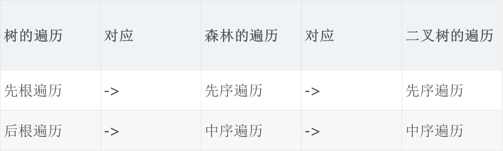


## 第十二章 优先队列
### 定义
优先级队列
优先级队列(priority queue)是0个或多个元素的集合， 每个元素都有一个优先级或值，允许相同。  
与FIFO结构的队列不同，优先级队列中元素出队列的顺序由元素的优先级决定。  
从优先级队列中删除元素是根据优先级高或低的次序，而不是元素进入队列的次序。  
对优先级队列执行的操作有:
- 查找一个元素(top)
- 插入一个新元素(push)
- 删除一个元素(pop)

### 堆
#### 定义
- 大根树(小根树)：**每个节点**的值都大于(小于)或等于其子节点(如果有的话)值的树。
- 大根堆(小根堆)：即是大根树(小根树)，又是**完全**二叉树。
#### 描述
使用一维数组
- 数据成员：
    - T *heap; // 元素数组
    - int arrayLength;  //数组的容量
    - int heapSize; //堆中的元素个数
- 方法： 
    - empty()
    - Size()
    - top()
    - pop()
    - push(x)

#### 插入
首先追加到末尾，如果优于父节点，则向上调整。  
不必考虑其兄弟节点，因为它>父节点>兄弟节点，所以直接与父节点交换。

时间复杂度 $ O(log n) $  

#### 删除
删除堆顶，把末尾元素置于堆顶；如果孩子中的较大者大于该节点，则交换，并重复此步。

时间复杂度 $ O(log n) $ 

#### 初始化
给定n个数，建立大根堆。  
通过n次插入，复杂度$ O(log n) $ 。

$ O(n) $ 的初始化：

把原序列作为层次序建立完全二叉树。  
从最后一个有子节点的节点开始往前，把以此节点为根的子树调整为大根堆。  
调整方式同删除的调整，因为此时其左子树和右子树分别为大根堆。
### 左高树*
堆是用数组实现的，需要连续空间。如果没有足够的连续空间就需要使用左高树，它是**链式**存储的。

#### 定义
- 外部节点( External node)：代替树中的空子树的节点。
- 内部节点( Internal node)：具有非空子树的节点。
- 扩充二叉树(Extended binary tree)：增加了外部节点的二叉树。
- 对扩充二叉树中的任意节点x，s(x)：从节点x 到它的子树的外部节点的所有路径中最短的一条路径长度。
    - 若x是外部节点，则 s(x) = 0
    - 否则，s(x) = min{ s(L), s(R) } + 1
- **高度优先左高树(HBLT)**：当且仅当一棵二叉树的任何一个内部节点，其左孩子的 s 值大于等于右孩子的 s 值时，该二叉树为高度优先左高树
- 最大HBLT：即同时又是最大树的HBLT

#### 合并两颗最大HBLT
A、B：需要合并的两棵最大HBLT  
- A、B其中一个为空，将另一个作为合并的结果；
- A、B均不为空
    - 比较A、B的根元素，较大者为合并后的HBLT的根
    - 设A具有较大的根，A的左子树为AL，A的右子树AR
    - A的右子树AR与B合并的结果：C
    - A与B合并的结果：以A的根为根，AL与C为左右子树的最大HBLT
    - 如果L的s值小于C的s值，则C为左子树，否则L为左子树

```C++
void merge(MaxHBLT *A, MaxHBLT *B){
    if( !A ){
        A = B;
        return;
    };

    //A有较大的根
    if( A->root < B->root ){
        swap(A, B)
    }

    //合并AR与B，s值较大者为左子树
    merge(A->right, B);
    if( A->right.s > A->left.s ){
        swap( A->right, A->left);
    }
}
```

#### 最大HBLT的插入
合并原树与新的单元素最大HBLT
    
#### 最大HBLT的删除
删掉根节点，合并左右子树。

#### 初始化最大HBLT
1. 创建n 个最大HBLT ，每个树中包含一个元素，这n 棵树排成一个FIFO队列
2. 从队列中依次删除两个最大HBLT ，将其合并，然后再加入队列末尾。
3. 重复第2步，直到最后只有一棵最大HBLT 。

时间复杂性: $ O(n) $

### 堆排序
使用 $ O(n) $ 初始化创建大根堆，删除 n 次，得到排序序列。  

时间复杂度 $ O(nlogn) $  
```C++
    //TODO
```

### 霍夫曼编码
一种文本压缩算法，使用变长编码对使用到的字符编码，故而没有任何一个代码是另一代码的前缀。

#### 定义

- n扩充二叉树外部节点标记为( 1...n )的**加权外部路径长度** **(Weighted External Path length)** : 

$$
WEP = \sum_{i=1}^{n}{L(i) \times F(i)}
$$

- **L(i)** ：从根到达外部节点*i* 的路径长度(即路径的边数)；

- **F(i)** ：外部节点 i 的权值(weight) .

- 如果F(i)是字符串中被编码的字符的频率, WEP 就是**压缩编码串的长度**.

- **霍夫曼树**：对于给定的频率具有**最小加权外部路径长度的二叉树**。

#### 构造霍夫曼树

1. 初始化二叉树集合，每个二叉树含一个外部节点，每个外部节点代表字符串中一个不同的字符。

2. 从集合中选择两棵具有最小权值的二叉树，并把它们合并成一棵新的二叉树。合并方法是把这两棵二叉树分别作为左右子树，然后增加一个新的根节点。新二叉树的权值为两棵子树的权值之和。

3. 重复第2步，直到仅剩下一棵树为止。

#### 获取霍夫曼编码

从根节点开始，左边标0，右边标1（或相反），外部节点（字符）的编码为从根节点到它路径上的数字。

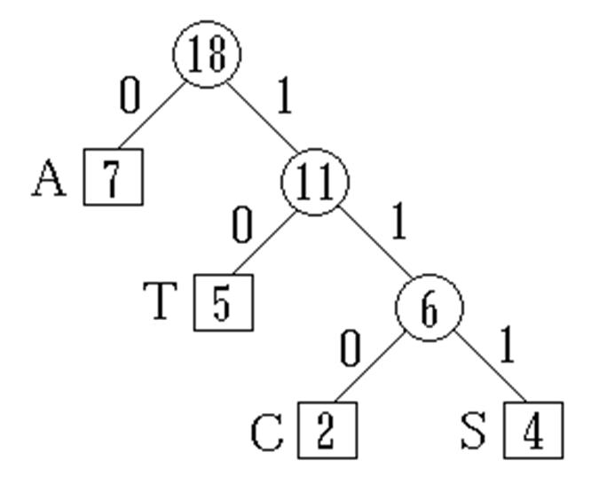

## 第十四章 搜索树

比跳表更优秀的链式存储表示字典。

### 二叉搜索树

#### 定义

**二叉搜索树**是一棵可能为空的二叉树，一棵非空的二叉搜索树满足以下特征：

- 每个元素有一个关键字，关键字都是唯一的。

- 根节点左子树的关键字(如果有的话)小于根节点的关键字。

- 根节点右子树的关键字(如果有的话)大于根节点的关键字。 

- 根节点的左右子树也都是二叉搜索树。

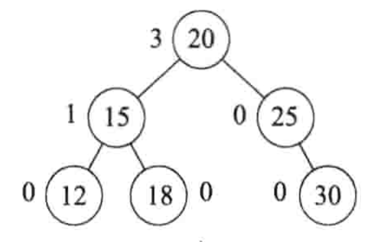

#### 查找

从根节点开始，

- 如果相等则返回
- 如果目标值大于节点值，则向右子树寻找
- 如果目标值小于节点值，则向左子树寻找
- 如果到达空节点，未找到

#### 操作IndexSearch(k)

IndexSearch(k,e)返回第k个元素  

- 如果k=x.LeftSize, 第k个元素是x.element

- 如果k<x.LeftSize, 第k个元素是x的左子树的第k个元素

- 如果k>x.LeftSize, 第k个元素是x的右子树的第(k - x.LeftSize)个元素 

#### 插入

在二叉搜索树中插入一个新元素e

- 首先搜索，验证e 的关键值是否存在

- 如果搜索成功，那么新元素将不被插入

- 如果搜索不成功，那么新元素将被插入到搜索的中断点（最后的null节点）

#### 删除

删除一个节点 v ，分三种情况

1. v 是叶子节点，直接删除

2. v 只有一个子节点

    - v 无父节点，即v为根节点，直接删，v 的唯一子节点称为根节点
    - v 有父节点p，删除 v ，其位置放置 v 的唯一子节点

3. v 有两个子节点：找到 v 的左子树中的最大子节点（或右子树中的最小子节点）c ，把 v 的值赋为 c 的值，删除 c 的位置。  
删除 c 回到1. 或2.，因为 c 最多有一个子，否则不可能为最值。


## 第十五章 平衡搜索树

### AVL搜索树

#### 定义

**AVL树：**

- 空树是AVL树
- 非空二叉树T，左右子树分别为$T_L$、$T_R$，需满足：
    - $T_L$、$T_R$都是AVL树
    - $\lvert h_L - h_R \lvert \leq 1$ （树高）

**AVL搜索树**：满足AVL的二叉搜索树。

#### 平衡因子
节点需要属性平衡因子Balance Factor，简称 BF，为左子树高度减右子树高度。

#### 插入

需要维护**平衡**的性质。首先按照二叉搜索树插入，如果产生了不平衡，进行调整。调整的目标为搜索+平衡。

命名规则为\[R L]\[R L]，插入节点位于不平衡节点的 ? 子树的 ? 子树。

LL

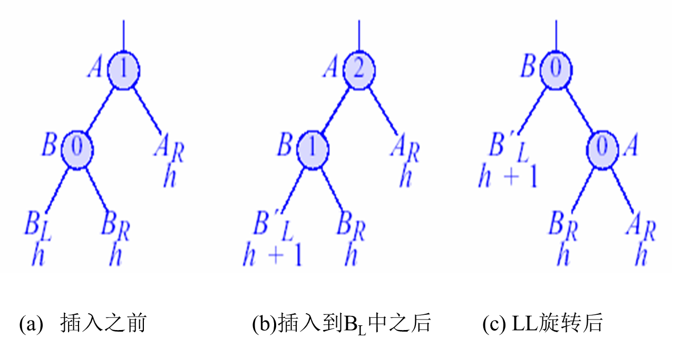

LR

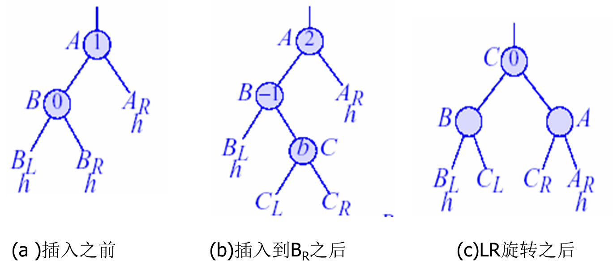

RR

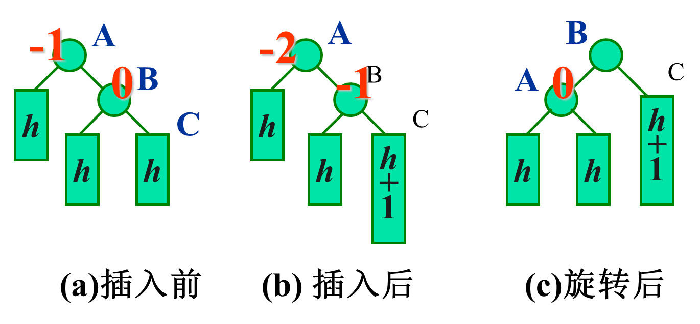

RL

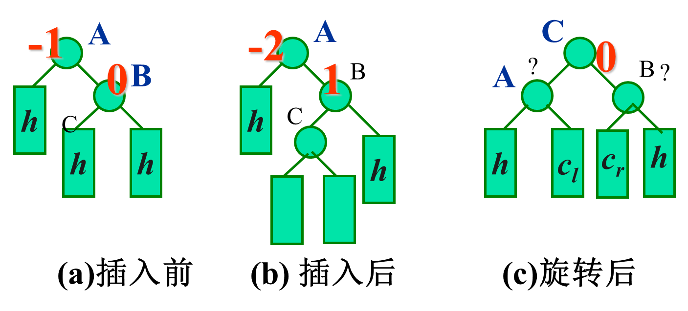

记忆法：A节点需要向另一侧（平衡侧）退，非平衡侧选一个上到A的位置，从路径上涉及到的离A最近的两个。非平衡侧为左，则选二者中的较大者；非平衡侧为右，则选二者中的较小者；并把其子节点左仍左，右仍右（如果有）。

#### 删除

由删除操作导致产生不平衡树的几种现象：

- 如果p新的平衡因子是0，那么它的高度减少了1，需要改变它的父节点(如果有的话)和其他某些祖先节点的平衡因子。
- 如果p新的平衡因子是－1或1，那么它的高度与删除前相同，无需改变其祖先的平衡因子值。

- 如果p新的平衡因子是－2或2，那么树在p节点是不平衡的。  

由删除操作产生的不平衡分为六种类型：R0, R1, R-1, L0, L1, L-1。
其命名规则是\[R L]\[-1, 0, 1]，第一个字母表示删除节点位于不平衡节点A的右/左侧，数字表示A的另一侧子节点的平衡因子。

设A是从p到根节点的路径第一个平衡因子变为2或－2的节点 

**R0 旋转:单旋转**


**R1 旋转:单旋转**

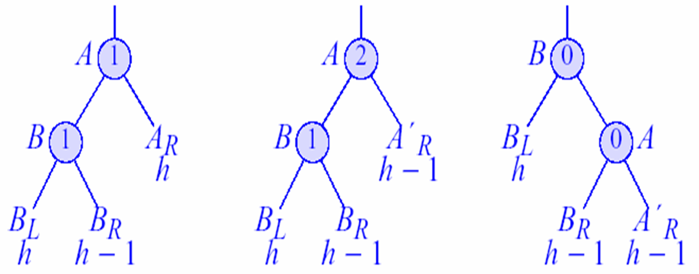

**R-1 旋转:双旋转**


**L0旋转**：与R0旋转镜像对称
**L1旋转**：与R-1旋转镜像对称
**L-1旋转**：与R1旋转镜像对称

R1、R-1、L-1、L1旋转会使子树高度减一，可能导致父节点不平衡，需要再次调整。

以上是AVL搜索树课本上的理论与我的理解，插入删除的旋转考试可能会考。下面这个视频讲的也挺好的，用两个调整规则处理插入和删除，但是与课本的词语不同，可以作为辅助理解。https://www.bilibili.com/video/BV1tZ421q72h/


### 红黑树*

来不及了先不学了

### B-树

当存储的数据很大，需要存放在硬盘（外部存储）中时，需要用到B树进行组织。

前置知识：

- 外存IO很慢，我们需要减少外存IO次数
- 对外存数据进行操作时，需要先调入内存中
- 对外存的存取是按**块**进行的

#### 定义

**m阶B-树**(B-Trees of Order m) 是一棵 m 叉搜索树，如果B-树非空，那么相应的**扩充树**满足下列特征：

1. 根节点至少有**2**个孩子。

2. 除了根节点以外，所有内部节点至少有 $ \lceil \frac{m}{2} \rceil $ 个孩子。

3. 所有外部节点位于同一层上。

解读：

- 根节点至少有一个元素，否则就是空树
- 除了根节点，所有内部节点有 $ \lceil \frac{m}{2} \rceil - 1 $  到  $ m-1 $ 个元素

4阶B树又称为2,3,4树或2-4树，因为每个内部节点可以有2~4个孩子。


#### 查找

从根节点开始，寻找第一个大于目标值的元素，转到其左邻的孩子，没有则转到最右孩子。如果找到目标值，则查找成功；如果进入空节点，则查找失败。

访盘次数即为搜索过的节点数。

#### 插入

查找应当插入的节点和位置，一定是在叶子节点，插入。如果插入后，当前节点的元素数目等于m，则为上溢出，需要分裂当前节点。

此时有m个元素，把第 $ \lceil \frac{m}{2} \rceil $ 个元素移入其父节点中，它的左边（ $ \lceil \frac{m}{2} \rceil -1 $个元素）和右边（ $m - \lceil \frac{m}{2} \rceil $  个元素）连同其孩子成为两个新的节点，指向父节点。

父节点有可能因移入的元素发生溢出，需要分裂。

一次分裂需要对两个新子节点写，对父节点写，共3次写操作。n次连锁分裂需要2n+1次写操作，因为中间的父节点写和下一次的新子节点写可合并为一个写操作。

#### 删除

- 删除元素位于叶子节点，直接删除。
- 删除元素位于非叶子节点，将其与左子树中的最大元素（或右子树中的最小元素）进行替换，转换为删除叶子节点。

可能导致节点的元素个数变为$ \lceil \frac{m}{2} \rceil - 2 $，发生下溢出，调整：

- 如果其兄弟节点元素个数大于$ \lceil \frac{m}{2} \rceil -1 $，则向兄弟节点“借”一个元素：把父节点对应元素移入本节点，把兄弟节点对应元素移入父节点。（父下来，兄上去）如果是左兄弟，选最大元素，右兄弟最小，父节点的元素为中间所夹的元素。
    磁盘访问次数为 搜索(h)+访问兄弟节点(1)+写回本、兄、父节点(3)，共h+4次，无连锁反应。

- 如果兄弟节点元素个数都等于$ \lceil \frac{m}{2} \rceil -1 $，则合并本节点与一个兄弟节点：取出父节点的中间元素，删掉它原本的位置，把它与本节点、兄弟节点合并为一个新的节点，并指向父节点。新节点元素个数为$ 2 \times \lceil \frac{m}{2} \rceil -2 $
    可能导致父节点下溢出，再进行调整。合并非叶节点时，要把子树也一块合过去。若导致根节点为空，则舍弃，新节点为根节点。
    单次合并访盘次数为 搜索(h)+访问兄弟节点(1)+写新节点和父节点(2)，共h+3次。连续n次合并，访盘次数h+2n+1，还需要看具体情况。

## 第十六章 图

### 基本概念
### 特性
### 抽象数据类型graph
### 无权图的描述
### 有权图的描述
### 类实现
### 图的遍历 
### 应用
#### 寻找路径
#### 连通图及其构件
#### 生成树


## 第十七章 贪心
>  个人理解：每一步，都选择当前情况下的最优选择。
>
> 因为局部最优不一定是全局最优，不是所有问题都适合用贪心。

### 拓扑排序

有向无环图的拓扑序列，每次删除一个入度为零的顶点，把它加入到拓扑序列中。

伪代码：

```
数组theOrder, 初始化空
数组inDegree，初始化全为零
栈stk

//初始化统计入度
for( i为图中的顶点 ){
	for( j被i可达 ){	//此处可使用迭代器
		inDegree[j]++
	}
}

//入度为零的压栈
for( i ){
	if(inDegree[i]==0) stk.push(i)
}

while( stk不为空 ){
	弹出stk栈顶 v
	for( i被v可达 ){	//此处可使用迭代器
		inDegree[i]--;
		if( inDegree[i]==0 ) stk压栈i
	}
}

if(栈stk元素个数等于图的元素个数) 成功，拓扑序列为theOrder
else 失败，图中有环
```


### 单源最短路

在带权有向图中，求一个顶点（源点）到其它所有顶点的最短路径。

**Dijkstra算法**（迪杰斯特拉）：可处理**非负边权**有向图。

- 初始状态，已到达顶点只有源顶点sourceVertex
- 每一步，从已到达顶点出发向未到达顶点的所有边中，选择一条边权最小的，并把对应顶点加入到已到达顶点中。

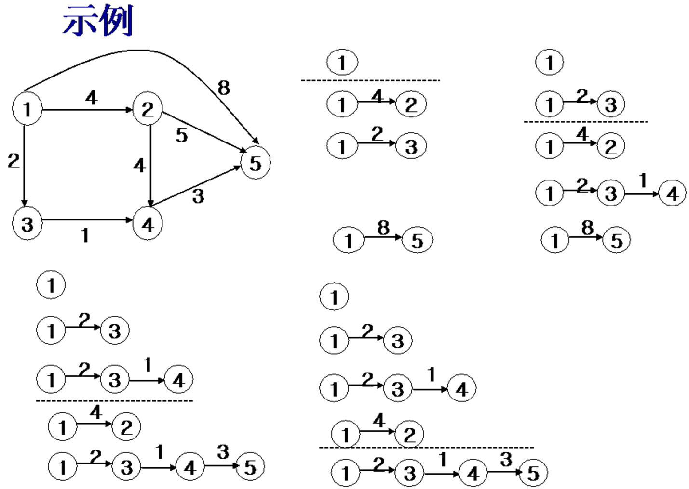

实现分析：

- distanceFromSource[n]: 存储每个顶点到源点的最短路径值
- *newReachable: 线性表，存储下一步可到达的顶点
- predecessor[n]: 存储从sourceVertex到某个顶点的路径中该顶点前面的那个顶点

伪代码：

```
for( i: 邻接于sourceVertex ){
	distanceFromSource[i] = 边权
	predecessor[i] = sourceVertex
	newReachable.push(i)
} 

predecessor[sourceVertex] = 0

其余顶点:
	distanceFromSource[i] = +∞
	predecessor[i] = -1

while( newReachable不为空 ){
	从newReachable中 选出并删除distanceFromSource值最小的顶点v
	for( i:邻接于v ){
		if( i不在newReachable中 ) 把i加入newReachable
		if( distanceFromVertex[v]+从v到i的边权 < distanceFromVertex[i] ){
			更新distanceFromSource[i]
			predecessor[i] = v
		}
	}
}
```

时间复杂度：课本上是 $ O(n^2) $, 可以更优。


### 最小生成树

图G(V, E)

数是有n个顶点，n-1条边的连通图，无环。

#### Kruskal (克鲁斯卡尔)算法

思想：

- 初始为含图中n个顶点，0条边的森林
- 从图中所有边中，选取一个具有最小边权的边
    - 如果加入此边不产生环，则选入此边
    - 否则舍去此边，之后不再考虑

分析：

我们需要能依次取出最小边，可以对边集进行排序，再依次取边；也可以使用小根堆。两者复杂度均为$ O(n+nlogn) = O(nlogn) $

还需要能判断加入某边后是否成环：使用并查集维护连通关系，考察的边的两个顶点如果原本连通，则加入后成环；否则可以加入，并把它们连通。

伪代码：

```
//使用最小堆+并查集
//并查集find()返回根节点，merge(a,b)连通a b

对边集建立最小堆
while(堆不为空){
	取出堆顶e
	e邻接于顶点i j
	if( find(i)==find(j) ) continue;
	else{
		merge(i, j)
		把e加入生成树中
	}
}
```


#### Prim(普里姆)算法

设TE表示已选择的边的集合，TV表示已选择的顶点的集合

- 初始选择任意一个顶点加入TV
- 在从TV里的顶点出发，到达不属于TV顶点的边中，选择边权最小的边加入TE中
- TE里的边数到达n-1时算法停止

伪代码

```
令 E 为网络中边的集合
While( E不为空 && |T| ≠ n-1) {
	令(u , v)为最小代价边，其中u  TV, v  TV
	If  (没有这种边)  break
	E=E - { (u,v) } / /从E中删除此边
	在 T 中加入边( u , v)
}
if(|T| == n- 1)  T是一棵最小生成树
else 网络是不连通的，没有最小生成树
```


## 第十八章 分治

> 个人理解：把问题不断拆分成小问题，直到问题小到很容易解决或者不用解决。然后把小问题的解合并合并为原问题的解
>
> 关键是如何拆分和合并

### 归并排序

把序列分割为两个小序列，直到序列只包含一个元素，此时的序列是有序的；之后合并有序序列。

```C++
template<class T>
void _merge(T *a, int na, T* b, int nb, T* dest){
    int pa = 0, pb = 0, n = 0;
    
    while(pa < na && pb < nb){
        if(a[pa] < b[pb]){
            dest[n++] = a[pa++];
        }else{
            dest[n++] = b[pb++];
        }
    }
    
    while(pa < na) dest[n++] = a[pa++];
    while(pb < nb) dest[n++] = b[pb++];
}

template<class T>
void mergeSort(T *arr, int n){
    if(n <= 1){
        return;
    }
    
    int mid = n / 2;
    mergeSort(arr, mid);
    mergeSort(arr + mid, n - mid);
    
    T* temp = new T[n];
    _merge(arr, mid, arr + mid, n - mid, temp);
    
    for(int i = 0; i < n; ++i){
        arr[i] = temp[i];
    }
    
    delete[] temp;
}
```

### 快速排序

从序列中选取一个枢轴变量pivot，把序列划分为两个部分left和right，其中left中的元素都小于等于pivot，right中的元素都大于pivot，递归处理这两段，合并结果为left+pivot+right。pivot的选取是任意的，这里我们每次选取序列的第一个元素。

我们可以选择新开一个数组，左边放left，右边放right，这样需要O(n)的空间。

也可以原地重排：使用两个指针l = 0，r = n。首先看r，如果a[r] <= pivot，就把它换到l的位置，接下来移动l，如果遇到大于pivot的元素就换到r的位置，接下来移动r，以此类推，直到l和r相等。

这样我们甚至不用合并。

### 第k小的元素

使用快速排序的思想，设划分出 left、pivot、right

- 如果left.size恰等于k-1，那么pivot就是第k小的元素。
- 如果left.size大于k-1，那么目标在left中，接下来需要在left中找第k小的元素
- 如果left.size小于k-1，那么目标在right中，接下来需要在right中找第k-left.size-1小的元素

这样比直接使用快速排序出有序序列，再找第k个要快。

## 第十九章 动态规划

> 动态规划不是一两句能说清楚的，重点在于**定义状态**和**状态转移**

### 01背包

> 动态规划入门必学的经典问题

有 𝑛 个物品和一个容量为 𝑊 的背包，每个物品有重量 $w_i$ 和价值 $v_i$ 两种属性，要求选若干物品放入背包使背包中物品的总价值最大且背包中物品的总重量不超过背包的容量。

```C++
int dp[N][W];
int W, n, w[N], v[N];

int main(){
    //输入省略
    for(int i = 1; i <= n; ++i){
        for(int j = W; j >= w[i]; --j){
            dp[i][j] = max( dp[i-1][j], dp[i-1][j-w[i]]+v[i]);
        }
    }
    
    cout << dp[n][W];
}
```


### 多源最短路Floyd(弗洛伊德)

图*G*中不含有长度为负数的环路。

定义状态：`c[i][j][k]`从 i 到 j 的最短路径值，要求中间经过的节点不大于k，初始为 i 到 j 的边权，无边则无穷大。

状态转移： `c[i][j][k] = min( c[i][j][k-1], c[i][k][k-1]+c[k][j][k-1])`

## [排序](/code/sort.cpp)
排序算法有两个额外关注的点  
- **在线**排序：排序过程中，会依次完成前k个元素的排序，不依赖后续的元素。即排序完成后，再追加一个元素可以继续按原来的算法，而用不重新排序，就把这个元素放到正确的位置。包括：
    - 插入排序
- **稳定**排序：如果一个排序算法能够保持同值元素之间的相对次序，则该算法被称之为稳定排序。如$3_1, 2, 3_2$ 排序后为$2, 3_1, 3_2$，两个3仍是原来的顺序。包括：
    - 桶排序
    > 这些排序**可以**是稳定的，取决于特定步骤

### 冒泡排序

每次比较相邻两个元素，如果前一个大于后一个，就交换；进行n-1轮，每次比较次数从n-1递减。

### 选择排序

每次在剩余元素中选择一个最小的，放到已排序列末尾；

### 插入排序

初始已排序列只包含第一个元素，此后依次把后一个元素插入到已排序列的正确位置当中。

### 名次排序（计数排序）

首先，对每个元素，统计小于等于它的元素个数，即它的名次。

然后，按名次依次收集元素。

### [箱子排序](#箱子排序桶排序)（桶排序）

### [基数排序](#基数排序)

### 堆排序

### 归并排序

### 快速排序